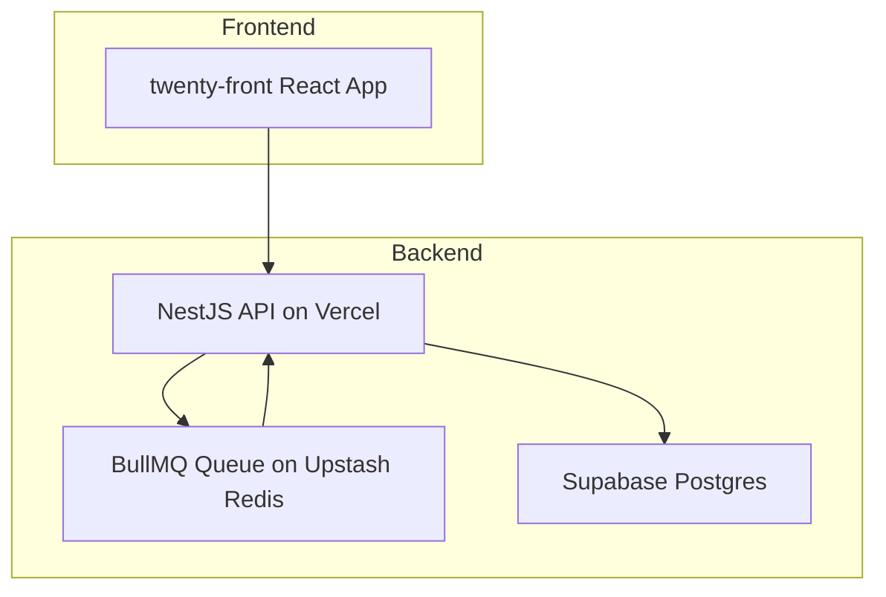

# HR Talent Platform Deployment Plan

## Overview
This document outlines the deployment plan for the HR Talent Platform, ensuring all frontend and backend features are production-ready, properly configured, and optimized for deployment on Vercel. It includes environment variable management, performance optimization, and CI/CD workflow setup.

## Frontend Deployment

- Build the `twenty-front` React application using the production build command.
- Ensure all UI components use `twenty-ui` and `twenty-front` packages exclusively.
- Remove any unused dependencies such as Chakra UI.
- Configure environment variables for API endpoints and keys in Vercel.
- Use Vercel's static hosting for the frontend build output.
- Enable source maps for production debugging if needed.
- Optimize bundle size using code splitting and tree shaking.

## Backend Deployment

- Adapt `twenty-server` NestJS backend to run as Vercel Serverless Functions.
- Split controllers into separate serverless functions if necessary for performance.
- Configure environment variables for Supabase, OpenAI, Upstash Redis, and other secrets.
- Ensure all database migrations are applied to the Supabase instance.
- Implement background job processing with BullMQ and Upstash Redis.
- Secure API endpoints with Supabase Auth and Row Level Security (RLS) policies.

## Environment Variables

- Use Vercel's environment variable management to securely store:
  - `NEXT_PUBLIC_SUPABASE_URL`
  - `NEXT_PUBLIC_SUPABASE_ANON_KEY`
  - `SUPABASE_SERVICE_ROLE_KEY`
  - `OPENAI_API_KEY`
  - `UPSTASH_REDIS_REST_URL`
  - `UPSTASH_REDIS_REST_TOKEN`
  - Other necessary keys and secrets

## CI/CD Workflow

- Use GitHub Actions to:
  - Run unit, integration, and e2e tests on pull requests.
  - Apply Supabase schema migrations.
  - Build and deploy preview environments to Vercel on PRs.
  - Deploy to production on merges to main branch.

## Performance Optimization

- Monitor API response times and optimize database queries.
- Use caching strategies where appropriate.
- Optimize AI agent calls and background job processing.
- Use Vercel analytics and logging for monitoring.

## Deployment Architecture Diagram

## Next Steps

- Implement and test backend endpoints for all advanced features.
- Integrate frontend with backend APIs.
- Perform end-to-end testing in staging environment.
- Monitor and optimize after production deployment.

---

This plan ensures a smooth deployment and operation of the HR Talent Platform with all advanced features integrated and optimized.