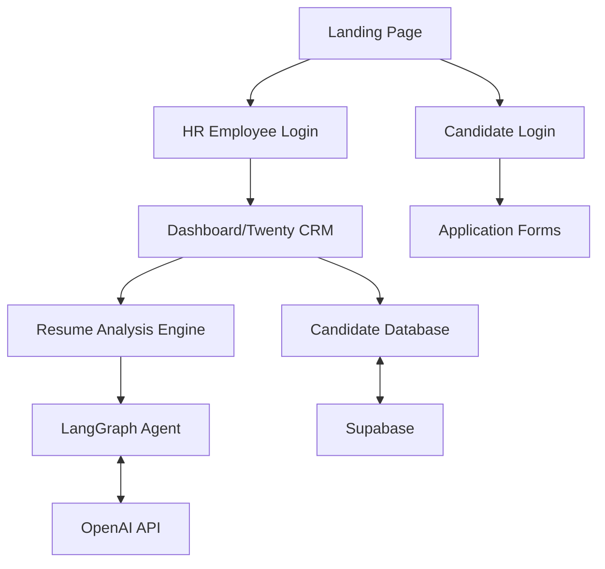

# Guide to Building an Advanced HR Talent Platform with AI Resume Analysis

This guide will help you build a tool for HR agencies to efficiently process job applications using AI-powered resume analysis. Your platform will leverage LangGraph agents to provide empirical scoring based on defined requirements.

## Architecture Overview



## Part 1: Foundation Setup

### Supabase Integration

```typescript name=supabase/config.ts
import { createClient } from '@supabase/supabase-js'

const supabaseUrl = process.env.NEXT_PUBLIC_SUPABASE_URL
const supabaseAnonKey = process.env.NEXT_PUBLIC_SUPABASE_ANON_KEY

export const supabase = createClient(supabaseUrl, supabaseAnonKey)
```

### Database Schema

Let's define the core tables needed:

```sql name=supabase/migrations/1_initial_schema.sql
-- Create the schema
CREATE SCHEMA IF NOT EXISTS giselle;

-- Create enum types
CREATE TYPE giselle.application_status AS ENUM (
  'new', 'reviewing', 'shortlisted', 'interviewed', 'offered', 'hired', 'rejected'
);

-- Create Jobs table
CREATE TABLE giselle.jobs (
  id UUID PRIMARY KEY DEFAULT uuid_generate_v4(),
  title TEXT NOT NULL,
  description TEXT NOT NULL,
  requirements JSONB NOT NULL,
  created_at TIMESTAMP WITH TIME ZONE DEFAULT NOW(),
  updated_at TIMESTAMP WITH TIME ZONE DEFAULT NOW(),
  is_active BOOLEAN DEFAULT TRUE
);

-- Create Candidates table
CREATE TABLE giselle.candidates (
  id UUID PRIMARY KEY DEFAULT uuid_generate_v4(),
  auth_id UUID REFERENCES auth.users,
  first_name TEXT NOT NULL,
  last_name TEXT NOT NULL,
  email TEXT UNIQUE NOT NULL,
  phone TEXT,
  resume_url TEXT,
  resume_text TEXT,
  skills JSONB,
  created_at TIMESTAMP WITH TIME ZONE DEFAULT NOW(),
  updated_at TIMESTAMP WITH TIME ZONE DEFAULT NOW()
);

-- Create Applications table
CREATE TABLE giselle.applications (
  id UUID PRIMARY KEY DEFAULT uuid_generate_v4(),
  candidate_id UUID REFERENCES giselle.candidates(id) ON DELETE CASCADE,
  job_id UUID REFERENCES giselle.jobs(id) ON DELETE SET NULL,
  status giselle.application_status DEFAULT 'new',
  ai_score NUMERIC(5,2),
  ai_analysis JSONB,
  hr_notes TEXT,
  created_at TIMESTAMP WITH TIME ZONE DEFAULT NOW(),
  updated_at TIMESTAMP WITH TIME ZONE DEFAULT NOW()
);

-- Create functions to handle timestamps
CREATE OR REPLACE FUNCTION giselle.handle_updated_at()
RETURNS TRIGGER AS $$
BEGIN
  NEW.updated_at = NOW();
  RETURN NEW;
END;
$$ LANGUAGE plpgsql;

-- Create triggers for updated_at
CREATE TRIGGER set_updated_at_jobs
BEFORE UPDATE ON giselle.jobs
FOR EACH ROW EXECUTE FUNCTION giselle.handle_updated_at();

CREATE TRIGGER set_updated_at_candidates
BEFORE UPDATE ON giselle.candidates
FOR EACH ROW EXECUTE FUNCTION giselle.handle_updated_at();

CREATE TRIGGER set_updated_at_applications
BEFORE UPDATE ON giselle.applications
FOR EACH ROW EXECUTE FUNCTION giselle.handle_updated_at();

-- Security policies
ALTER TABLE giselle.jobs ENABLE ROW LEVEL SECURITY;
ALTER TABLE giselle.candidates ENABLE ROW LEVEL SECURITY;
ALTER TABLE giselle.applications ENABLE ROW LEVEL SECURITY;

-- HR staff can see everything
CREATE POLICY "HR staff can see all jobs" ON giselle.jobs
  FOR SELECT USING (auth.uid() IN (
    SELECT auth_id FROM giselle.hr_staff
  ));

CREATE POLICY "HR staff can see all candidates" ON giselle.candidates
  FOR SELECT USING (auth.uid() IN (
    SELECT auth_id FROM giselle.hr_staff
  ));

CREATE POLICY "HR staff can see all applications" ON giselle.applications
  FOR SELECT USING (auth.uid() IN (
    SELECT auth_id FROM giselle.hr_staff
  ));

-- Candidates can only see their own data and active jobs
CREATE POLICY "Candidates can see active jobs" ON giselle.jobs
  FOR SELECT USING (is_active = TRUE);

CREATE POLICY "Candidates can only see their own profile" ON giselle.candidates
  FOR SELECT USING (auth.uid() = auth_id);

CREATE POLICY "Candidates can only see their own applications" ON giselle.applications
  FOR SELECT USING (
    candidate_id IN (
      SELECT id FROM giselle.candidates WHERE auth_id = auth.uid()
    )
  );
```

## Part 2: LangGraph AI Resume Analysis Agent

### Setting Up the LangGraph Agent

```typescript name=lib/agents/resume-analyzer.ts
import { ChatOpenAI } from "langchain/chat_models/openai";
import { createAgent, createFlow, createToolNode } from "langgraph/graph";
import { HumanMessage, AIMessage, SystemMessage } from "langchain/schema";
import { StringOutputParser } from "langchain/schema/output_parser";

// Initialize the LLM
const llm = new ChatOpenAI({
  modelName: "gpt-4o",
  temperature: 0,
});

// Create extraction tool to pull skills from resume
const extractSkillsNode = createToolNode({
  name: "extract_skills",
  description: "Extract skills and experience from a resume",
  inputSchema: {
    resume: {
      type: "string",
      description: "The resume text content",
    }
  },
  handler: async ({ resume }) => {
    const response = await llm.invoke([
      new SystemMessage(`You are a skilled HR professional. Extract ALL technical skills, soft skills, and experience from the resume. Format as a JSON object with three keys: "technicalSkills", "softSkills", and "experience".`),
      new HumanMessage(resume)
    ]);
    return JSON.parse(response.content);
  }
});

// Create matching tool to compare requirements with resume
const matchJobRequirementsNode = createToolNode({
  name: "match_job_requirements",
  description: "Match job requirements against candidate skills",
  inputSchema: {
    jobRequirements: {
      type: "object",
      description: "Job requirements object"
    },
    candidateSkills: {
      type: "object",
      description: "Candidate skills and experience"
    }
  },
  handler: async ({ jobRequirements, candidateSkills }) => {
    const response = await llm.invoke([
      new SystemMessage(`You are a skilled HR professional. Compare the job requirements with the candidate's skills and experience. 
      Provide a detailed analysis of the match with the following:
      1. Overall percentage match score (0-100)
      2. Key matches between requirements and candidate profile
      3. Important missing qualifications
      4. Additional candidate strengths not required but valuable
      Return as a JSON object with keys: "matchScore", "keyMatches", "missingQualifications", "additionalStrengths"`),
      new HumanMessage(`Job Requirements: ${JSON.stringify(jobRequirements)}\n\nCandidate Skills: ${JSON.stringify(candidateSkills)}`)
    ]);
    return JSON.parse(response.content);
  }
});

// Create a node for summarizing the analysis
const generateSummaryNode = createToolNode({
  name: "generate_summary",
  description: "Generate a summary of the candidate analysis",
  inputSchema: {
    matchResults: {
      type: "object",
      description: "The results of the job matching"
    },
    candidateSkills: {
      type: "object",
      description: "Candidate skills and experience"
    }
  },
  handler: async ({ matchResults, candidateSkills }) => {
    const response = await llm.invoke([
      new SystemMessage(`Generate a concise summary for HR professionals about this candidate. Include key strengths, weaknesses, fit for role, and recommended next steps.`),
      new HumanMessage(`Match Results: ${JSON.stringify(matchResults)}\n\nCandidate Details: ${JSON.stringify(candidateSkills)}`)
    ]);
    return response.content;
  }
});

// Define the agent workflow
export const resumeAnalysisFlow = createFlow({
  nodes: {
    extractSkills: extractSkillsNode,
    matchJobRequirements: matchJobRequirementsNode,
    generateSummary: generateSummaryNode,
  },
  edges: {
    start: "extractSkills",
    extractSkills: "matchJobRequirements",
    matchJobRequirements: "generateSummary",
    generateSummary: "end",
  }
});

// Create the agent
export const resumeAnalysisAgent = createAgent({
  name: "ResumeAnalyzer",
  description: "Analyzes resumes and matches them to job requirements",
  flow: resumeAnalysisFlow,
});
```

### Handler for Resume Analysis

```typescript name=pages/api/analyze-resume.ts
import { NextApiRequest, NextApiResponse } from 'next';
import { supabase } from '../../supabase/config';
import { resumeAnalysisAgent } from '../../lib/agents/resume-analyzer';

export default async function handler(req: NextApiRequest, res: NextApiResponse) {
  if (req.method !== 'POST') {
    return res.status(405).json({ message: 'Method not allowed' });
  }

  try {
    const { applicationId } = req.body;
    
    // Get application details with resume and job requirements
    const { data: application, error: appError } = await supabase
      .from('giselle.applications')
      .select(`
        id,
        candidates:candidate_id (id, resume_text),
        jobs:job_id (id, requirements)
      `)
      .eq('id', applicationId)
      .single();
    
    if (appError || !application) {
      return res.status(404).json({ message: 'Application not found' });
    }
    
    // Parse the requirements and resume text
    const jobRequirements = application.jobs.requirements;
    const resumeText = application.candidates.resume_text;

    if (!resumeText) {
      return res.status(400).json({ message: 'No resume text available for analysis' });
    }

    // Run the LangGraph agent
    const result = await resumeAnalysisAgent.invoke({
      resume: resumeText,
      jobRequirements: jobRequirements,
    });

    // Extract the skills and analysis data
    const candidateSkills = result.extractSkills.output;
    const matchResults = result.matchJobRequirements.output;
    const summary = result.generateSummary.output;

    // Update the application with the analysis results
    const { error: updateError } = await supabase
      .from('giselle.applications')
      .update({
        ai_score: matchResults.matchScore,
        ai_analysis: {
          skills: candidateSkills,
          matching: matchResults,
          summary: summary
        }
      })
      .eq('id', applicationId);

    if (updateError) {
      console.error('Error updating application:', updateError);
      return res.status(500).json({ message: 'Failed to update application with analysis' });
    }

    return res.status(200).json({
      message: 'Resume analysis complete',
      score: matchResults.matchScore,
      summary: summary,
      analysis: {
        skills: candidateSkills,
        matching: matchResults
      }
    });
  } catch (error) {
    console.error('Error in resume analysis:', error);
    return res.status(500).json({ message: 'Internal server error' });
  }
}
```

## Part 3: Integrating with Twenty CRM

### Twenty CRM Adapter

```typescript name=lib/adapters/twenty-adapter.ts
import axios from 'axios';
import { supabase } from '../../supabase/config';

// This adapter maps your Supabase data model to Twenty's expected format
export class TwentyAdapter {
  private baseUrl: string;
  private apiKey: string;

  constructor(baseUrl: string, apiKey: string) {
    this.baseUrl = baseUrl;
    this.apiKey = apiKey;
  }

  // Convert Giselle candidates to Twenty CRM people
  async syncCandidatesToTwenty() {
    try {
      // Fetch candidates from Supabase
      const { data: candidates, error } = await supabase
        .from('giselle.candidates')
        .select('*');

      if (error) throw error;

      // Map to Twenty's data model
      const twentyPeople = candidates.map(candidate => ({
        firstName: candidate.first_name,
        lastName: candidate.last_name,
        email: candidate.email,
        phone: candidate.phone,
        // Add custom fields for HR context
        customFields: {
          candidateId: candidate.id,
          resumeUrl: candidate.resume_url
        }
      }));

      // Sync with Twenty API (you'll need to implement this based on Twenty's API)
      return twentyPeople;
    } catch (error) {
      console.error('Error syncing candidates to Twenty:', error);
      throw error;
    }
  }

  // Convert Giselle jobs to Twenty CRM opportunities
  async syncJobsToTwenty() {
    try {
      // Fetch jobs from Supabase
      const { data: jobs, error } = await supabase
        .from('giselle.jobs')
        .select('*');

      if (error) throw error;

      // Map to Twenty's opportunities model
      const twentyOpportunities = jobs.map(job => ({
        name: job.title,
        description: job.description,
        // Add custom fields for job details
        customFields: {
          jobId: job.id,
          requirements: job.requirements
        }
      }));

      return twentyOpportunities;
    } catch (error) {
      console.error('Error syncing jobs to Twenty:', error);
      throw error;
    }
  }
}
```

## Part 4: User Interface Components

### HR Dashboard Component

```typescript name=components/HRDashboard.tsx
import React, { useState, useEffect } from 'react';
import { supabase } from '../supabase/config';
import { 
  Box, Flex, Heading, Table, Thead, Tbody, Tr, Th, Td, 
  Badge, Text, Button, useDisclosure, Modal, ModalOverlay, 
  ModalContent, ModalHeader, ModalBody, ModalCloseButton,
  Progress, Stat, StatLabel, StatNumber, StatHelpText,
  Tabs, TabList, TabPanels, Tab, TabPanel
} from '@chakra-ui/react';

interface Candidate {
  id: string;
  first_name: string;
  last_name: string;
  email: string;
  resume_url: string;
}

interface Application {
  id: string;
  candidate: Candidate;
  job: {
    id: string;
    title: string;
  };
  status: string;
  ai_score: number;
  ai_analysis: any;
  created_at: string;
}

export default function HRDashboard() {
  const [applications, setApplications] = useState<Application[]>([]);
  const [selectedApp, setSelectedApp] = useState<Application | null>(null);
  const { isOpen, onOpen, onClose } = useDisclosure();
  const [isLoading, setIsLoading] = useState(true);

  useEffect(() => {
    fetchApplications();
  }, []);

  async function fetchApplications() {
    setIsLoading(true);
    const { data, error } = await supabase
      .from('giselle.applications')
      .select(`
        id,
        status,
        ai_score,
        ai_analysis,
        created_at,
        candidate:candidate_id (id, first_name, last_name, email, resume_url),
        job:job_id (id, title)
      `)
      .order('created_at', { ascending: false });

    if (error) {
      console.error('Error fetching applications:', error);
    } else {
      setApplications(data || []);
    }
    setIsLoading(false);
  }

  const analyzeResume = async (applicationId: string) => {
    try {
      const response = await fetch('/api/analyze-resume', {
        method: 'POST',
        headers: {
          'Content-Type': 'application/json',
        },
        body: JSON.stringify({ applicationId }),
      });
      
      if (!response.ok) throw new Error('Analysis failed');
      
      await fetchApplications();
    } catch (error) {
      console.error('Error analyzing resume:', error);
    }
  };

  const openDetails = (app: Application) => {
    setSelectedApp(app);
    onOpen();
  };

  return (
    <Box p={5}>
      <Flex justify="space-between" align="center" mb={5}>
        <Heading size="lg">HR Dashboard</Heading>
        <Button colorScheme="blue" onClick={fetchApplications}>Refresh</Button>
      </Flex>

      {isLoading ? (
        <Progress isIndeterminate />
      ) : (
        <Table variant="simple">
          <Thead>
            <Tr>
              <Th>Candidate</Th>
              <Th>Job</Th>
              <Th>Status</Th>
              <Th>AI Score</Th>
              <Th>Applied</Th>
              <Th>Actions</Th>
            </Tr>
          </Thead>
          <Tbody>
            {applications.map((app) => (
              <Tr key={app.id}>
                <Td>{app.candidate.first_name} {app.candidate.last_name}</Td>
                <Td>{app.job.title}</Td>
                <Td>
                  <Badge colorScheme={
                    app.status === 'shortlisted' ? 'green' : 
                    app.status === 'rejected' ? 'red' : 
                    app.status === 'new' ? 'blue' : 'gray'
                  }>
                    {app.status}
                  </Badge>
                </Td>
                <Td>
                  {app.ai_score ? (
                    <Badge colorScheme={
                      app.ai_score > 80 ? 'green' : 
                      app.ai_score > 60 ? 'yellow' : 
                      'red'
                    }>
                      {app.ai_score}%
                    </Badge>
                  ) : (
                    <Badge colorScheme="gray">Not analyzed</Badge>
                  )}
                </Td>
                <Td>{new Date(app.created_at).toLocaleDateString()}</Td>
                <Td>
                  <Button size="sm" mr={2} onClick={() => openDetails(app)}>
                    Details
                  </Button>
                  {!app.ai_score && (
                    <Button 
                      size="sm" 
                      colorScheme="teal"
                      onClick={() => analyzeResume(app.id)}
                    >
                      Analyze
                    </Button>
                  )}
                </Td>
              </Tr>
            ))}
          </Tbody>
        </Table>
      )}

      {/* Candidate Details Modal */}
      {selectedApp && (
        <Modal isOpen={isOpen} onClose={onClose} size="xl">
          <ModalOverlay />
          <ModalContent>
            <ModalHeader>
              {selectedApp.candidate.first_name} {selectedApp.candidate.last_name}
            </ModalHeader>
            <ModalCloseButton />
            <ModalBody pb={6}>
              <Tabs>
                <TabList>
                  <Tab>Summary</Tab>
                  <Tab>Skills Analysis</Tab>
                  <Tab>Job Match</Tab>
                </TabList>
                <TabPanels>
                  <TabPanel>
                    <Flex mb={4}>
                      <Stat>
                        <StatLabel>AI Match Score</StatLabel>
                        <StatNumber>{selectedApp.ai_score || 'N/A'}%</StatNumber>
                        <StatHelpText>Applied for {selectedApp.job.title}</StatHelpText>
                      </Stat>
                    </Flex>
                    {selectedApp.ai_analysis?.summary && (
                      <Box mt={4}>
                        <Heading size="sm" mb={2}>Analysis Summary</Heading>
                        <Text>{selectedApp.ai_analysis.summary}</Text>
                      </Box>
                    )}
                    <Box mt={4}>
                      <Heading size="sm" mb={2}>Contact Info</Heading>
                      <Text>Email: {selectedApp.candidate.email}</Text>
                      <Text mt={2}>
                        <a 
                          href={selectedApp.candidate.resume_url} 
                          target="_blank" 
                          rel="noopener noreferrer"
                          style={{ color: 'blue', textDecoration: 'underline' }}
                        >
                          Download Resume
                        </a>
                      </Text>
                    </Box>
                  </TabPanel>
                  <TabPanel>
                    {selectedApp.ai_analysis?.skills ? (
                      <>
                        <Box mb={4}>
                          <Heading size="sm" mb={2}>Technical Skills</Heading>
                          <Flex wrap="wrap">
                            {selectedApp.ai_analysis.skills.technicalSkills.map((skill: string, i: number) => (
                              <Badge key={i} m={1} colorScheme="blue">{skill}</Badge>
                            ))}
                          </Flex>
                        </Box>
                        <Box mb={4}>
                          <Heading size="sm" mb={2}>Soft Skills</Heading>
                          <Flex wrap="wrap">
                            {selectedApp.ai_analysis.skills.softSkills.map((skill: string, i: number) => (
                              <Badge key={i} m={1} colorScheme="purple">{skill}</Badge>
                            ))}
                          </Flex>
                        </Box>
                      </>
                    ) : (
                      <Text>No skills analysis available</Text>
                    )}
                  </TabPanel>
                  <TabPanel>
                    {selectedApp.ai_analysis?.matching ? (
                      <>
                        <Box mb={4}>
                          <Heading size="sm" mb={2}>Key Matches</Heading>
                          <Text>{selectedApp.ai_analysis.matching.keyMatches.join(', ')}</Text>
                        </Box>
                        <Box mb={4}>
                          <Heading size="sm" mb={2}>Missing Qualifications</Heading>
                          <Text>{selectedApp.ai_analysis.matching.missingQualifications.join(', ')}</Text>
                        </Box>
                        <Box mb={4}>
                          <Heading size="sm" mb={2}>Additional Strengths</Heading>
                          <Text>{selectedApp.ai_analysis.matching.additionalStrengths.join(', ')}</Text>
                        </Box>
                      </>
                    ) : (
                      <Text>No matching analysis available</Text>
                    )}
                  </TabPanel>
                </TabPanels>
              </Tabs>
            </ModalBody>
          </ModalContent>
        </Modal>
      )}
    </Box>
  );
}
```

## Part 5: Best Practices for LLM Integration

### Prompt Engineering for Resume Analysis

```typescript name=lib/prompts/resume-prompts.ts
export const SKILL_EXTRACTION_PROMPT = `
You are an expert HR AI assistant specialized in analyzing resumes and extracting skills.

Your task is to extract and categorize ALL skills and experience from the provided resume text.

Please return a JSON object with the following structure:
{
  "technicalSkills": [...], // List of all technical skills (programming languages, tools, platforms, etc.)
  "softSkills": [...],     // List of soft skills (communication, leadership, etc.)
  "experience": [...]      // List of work experiences with company and duration where available
}

Be thorough and comprehensive. Include ALL relevant skills mentioned in the resume.
`;

export const JOB_MATCHING_PROMPT = `
You are an expert HR AI assistant specialized in matching candidates to job requirements.

Analyze how well the candidate's profile matches the job requirements.
Be objective, fair, and consider both explicit and implicit qualifications.

Return a JSON object with the following structure:
{
  "matchScore": 85, // Overall match percentage (0-100)
  "keyMatches": [...], // List of important matching qualifications
  "missingQualifications": [...], // List of important requirements the candidate lacks
  "additionalStrengths": [...] // Candidate strengths beyond the requirements
}

Justification rules:
1. Base the score on objective evidence from the resume
2. Consider skills, experience, education, and certifications
3. Weigh technical requirements more heavily for technical roles
4. Consider transferable skills where direct experience is missing
5. Be fair and avoid bias based on factors not relevant to job performance
`;

export const SUMMARY_PROMPT = `
You are an expert HR AI assistant helping recruiters understand candidate profiles quickly.

Create a concise summary (2-3 paragraphs) that gives HR professionals a clear picture of:
1. The candidate's key qualifications and experience
2. How well they match the job requirements
3. Their main strengths and any significant gaps
4. Recommended next steps (interview, reject, consider for different role)

Make your summary actionable, objective, and focused on helping HR make informed decisions.
`;
```

### Evaluation and Testing

```typescript name=lib/evaluation/resume-analyzer-test.ts
import fs from 'fs';
import path from 'path';
import { resumeAnalysisAgent } from '../agents/resume-analyzer';

// Function to test the resume analyzer with a sample dataset
export async function testResumeAnalyzer() {
  try {
    // Load test data
    const testDataPath = path.join(process.cwd(), 'test-data');
    const resumePath = path.join(testDataPath, 'sample-resume.txt');
    const jobReqPath = path.join(testDataPath, 'sample-job-requirements.json');
    
    const resumeText = fs.readFileSync(resumePath, 'utf8');
    const jobRequirements = JSON.parse(fs.readFileSync(jobReqPath, 'utf8'));
    
    console.log('Running resume analysis test...');
    
    // Run the analysis
    const result = await resumeAnalysisAgent.invoke({
      resume: resumeText,
      jobRequirements: jobRequirements,
    });
    
    // Output the results
    console.log('===== TEST RESULTS =====');
    console.log('Extracted Skills:', JSON.stringify(result.extractSkills.output, null, 2));
    console.log('Job Matching:', JSON.stringify(result.matchJobRequirements.output, null, 2));
    console.log('Summary:', result.generateSummary.output);
    
    return {
      success: true,
      results: result
    };
  } catch (error) {
    console.error('Test failed:', error);
    return {
      success: false,
      error
    };
  }
}

// If running this file directly
if (require.main === module) {
  testResumeAnalyzer()
    .then(result => {
      if (result.success) {
        console.log('Test completed successfully');
      } else {
        console.error('Test failed');
      }
    })
    .catch(error => {
      console.error('Error running test:', error);
    });
}
```

## Part 6: Deployment and Integration Planning

### Vercel Deployment Configuration

```json name=vercel.json
{
  "version": 2,
  "functions": {
    "pages/api/**/*.ts": {
      "memory": 1024,
      "maxDuration": 60
    }
  },
  "rewrites": [
    { "source": "/(.*)", "destination": "/" }
  ],
  "env": {
    "NEXT_PUBLIC_SUPABASE_URL": "@supabase_url",
    "NEXT_PUBLIC_SUPABASE_ANON_KEY": "@supabase_anon_key",
    "OPENAI_API_KEY": "@openai_api_key",
    "TWENTY_API_BASE_URL": "@twenty_api_base_url",
    "TWENTY_API_KEY": "@twenty_api_key"
  }
}
```

### Integration Roadmap

```markdown name=INTEGRATION_ROADMAP.md
# Integration Roadmap

## Phase 1: Foundation (Week 1-2)
- [x] Set up Supabase database with core tables
- [x] Implement authentication for HR users and candidates
- [x] Create basic landing page with login options
- [x] Set up application form for candidates
- [ ] Deploy initial version to Vercel

## Phase 2: AI Resume Analysis (Week 3-4)
- [ ] Implement LangGraph agent for resume parsing
- [ ] Build job matching algorithm with OpenAI integration
- [ ] Create database structure for storing analysis results
- [ ] Develop API endpoints for resume analysis
- [ ] Add unit tests for analysis accuracy

## Phase 3: Twenty CRM Integration (Week 5-6)
- [ ] Fork and customize Twenty CRM for HR use case
- [ ] Create data syncing between Supabase and Twenty
- [ ] Implement HR dashboard with Twenty components
- [ ] Add candidate/application management UI
- [ ] Integrate analysis results into Twenty views

## Phase 4: Advanced Features (Week 7-8)
- [ ] Implement interview scheduling functionality
- [ ] Add candidate comparison tools
- [ ] Create analytics dashboard for HR managers
- [ ] Build email notification system
- [ ] Implement feedback collection from HR users

## Phase 5: Testing and Refinement (Week 9-10)
- [ ] Conduct usability testing with HR professionals
- [ ] Optimize AI models based on real resume data
- [ ] Performance testing and optimizations
- [ ] Security audit and enhancements
- [ ] Documentation and training materials
```

## Best Practices Summary

1. **LLM Integration**:
   - Use structured outputs (JSON) for consistent data format
   - Implement evaluation metrics to assess analysis quality
   - Create specialized agents for different aspects of resume processing
   - Use clear, detailed prompts with examples for better results
   - Implement feedback loops to improve accuracy over time

2. **Architecture**:
   - Keep LLM processing in serverless functions to manage costs
   - Store analysis results in Supabase for quick retrieval
   - Use edge functions for performance-critical operations
   - Implement caching to reduce redundant API calls
   - Create a clear separation between UI and AI processing logic

3. **Security and Privacy**:
   - Implement proper access controls with Supabase RLS
   - Store sensitive candidate data securely
   - Consider privacy implications of AI analysis
   - Implement audit trails for HR actions
   - Allow candidates to control their data

4. **Performance**:
   - Optimize LLM prompt design to minimize token usage
   - Use background jobs for long-running analyses
   - Implement proper error handling and retry mechanisms
   - Monitor API usage and costs regularly
   - Use incremental analysis to avoid reprocessing unchanged data

5. **User Experience**:
   - Provide clear explanations of AI-generated scores
   - Allow HR professionals to override or adjust AI recommendations
   - Design intuitive interfaces for viewing candidate analyses
   - Implement proper loading states for async operations
   - Make the system adaptable to different hiring workflows

This guide should give you a strong foundation for building your HR talent platform with advanced AI resume analysis capabilities using Supabase, LangGraph agents, and the Twenty CRM integrated with Vercel deployment.


Summary

This guide offers a comprehensive blueprint for building a modern, serverless HR talent platform using Supabase, Vercel, TwentyHQ CRM, Upstash Redis, and LangGraph agents. It outlines best practices for securing Supabase with Row Level Security and PostgREST policies  , deploying a NestJS backend as Vercel serverless functions  , and powering BullMQ queues with Upstash Redis in a fully serverless architecture  . We explain how to adapt the TwentyHQ CRM monorepo for Supabase integration and Nx tooling  , design agentic LLM workflows with LangGraph for resume ingestion and scoring   , and leverage open‑source resume parsers like OpenResume alongside top commercial tools for benchmarking   . Additionally, we cover AI bias mitigation through regular audits and blind screening   , CI/CD pipelines with GitHub Actions for Supabase and Vercel deployments   , interview scheduling automation  , and cost‑effective scalability strategies  .

⸻

1. Architecture Overview

1.1 Supabase Setup

Enable Row Level Security (RLS) on all tables and define fine‑grained policies to ensure only authenticated HR staff or candidates access their respective records  .
Combine RLS with Supabase Auth and PostgREST to enforce these rules end‑to‑end, mapping HTTP verbs to SQL policies for granular control  .

1.2 Vercel Serverless Deployment

Configure vercel.json to deploy NestJS controllers as separate serverless functions, optimizing cold‑start times by splitting endpoints  .
Ensure the application is stateless, persisting sessions or temporary state in Supabase or external storage rather than in memory  .
Use the @vercel/node runtime to wrap your NestJS bootstrap in a handler that Vercel can invoke  .

1.3 Background Jobs with Upstash Redis

Adopt Upstash Redis as a serverless Redis provider to back BullMQ queues without managing infrastructure  .
Integrate BullMQ tasks in Vercel functions, leveraging Upstash’s low‑latency endpoints and QStash for scheduled jobs  .

⸻

2. Integrating TwentyHQ CRM

Fork the TwentyHQ monorepo and update its NestJS backend’s database configuration to use your Supabase connection string  .
Adapt any custom SQL migrations or extensions to match Supabase’s managed Postgres environment, and configure Nx in the monorepo to include both your custom HR modules and Twenty’s libraries  .

⸻

3. Agentic LLM Workflows

Design a LangGraph pipeline starting with an Ingestion Agent that uses LLM calls to extract structured resume data (experience, education, skills)  .
Next, implement a Scoring Agent that computes sub‑scores by comparing extracted attributes against role requirements, followed by a Decision Agent that aggregates these into an overall match score  .

⸻

4. Resume Parsing & Scoring

Integrate an open‑source resume parser like OpenResume to convert CV documents into JSON objects with normalized fields  .
Benchmark its output against commercial parsers (e.g., RChilli, Textkernel) to tune your scoring rubrics and ensure high extraction accuracy  .

⸻

5. Bias Mitigation

Conduct regular audits of match scores to detect demographic disparities, using stratified sampling across gender and age  .
Implement blind screening by masking candidate identifiers during the agentic analysis phase to minimize name‑based or appearance bias  .
Leverage AI for SMEs to reduce bias and focus on skill‑based matching, as seen in Employment Hero’s SmartMatch tool  .

⸻

6. Interview Scheduling and Management

Use QStash or Vercel Cron to trigger scheduling functions that check interviewer availability via Google Calendar API and generate candidate booking links  .
Automate reminder emails and SMS via Supabase Edge Functions or webhook‑based workers to reduce no‑show rates  .

⸻

7. Candidate Comparison & Analytics

Use Supabase Realtime Broadcast or Postgres Changes to push new application events to the frontend dashboard as soon as resumes are parsed and scored  .
Enhance the TwentyHQ React UI to display interactive tables of candidates, sortable by overall match score, sub‑score categories, and interview status  .

⸻

8. CI/CD, Monitoring, and Maintenance

Set up GitHub Actions to run linting, tests, and Supabase CLI commands on pull requests, deploying preview environments to Vercel automatically   .
Trigger production deployments on merges to main, including automated database migrations and post‑deploy health checks.

⸻

9. Security, Compliance, and Best Practices

Implement GDPR‑compliant data workflows with deletion endpoints and consent logs, and maintain audit trails of AI model versions for accountability  .
Monitor AI‑agent performance and model drift, and ensure human oversight in final hiring decisions to comply with emerging regulations  .

⸻

Agent Prompt for “roo code”

You are “roo code,” an autonomous coding agent. Your task is to extend the GitHub repository https://github.com/andrewkoumoudjian/giselle0.2 into a full-featured, serverless HR talent platform for agencies. 

Requirements:
1. **Supabase Configuration**  
   - Enable Row Level Security on all tables; write RLS policies for candidate and HR roles.  
   - Configure PostgREST for granular API access.

2. **Vercel Serverless Backend**  
   - Refactor NestJS controllers into individual serverless functions using `@vercel/node`.  
   - Create a `vercel.json` with proper routes and environment variables.

3. **Background Jobs**  
   - Integrate Upstash Redis and BullMQ; implement job handlers for resume parsing and scoring.  
   - Use QStash for scheduled tasks (e.g., nightly analytics and reminders).

4. **TwentyHQ CRM Integration**  
   - Adapt the TwentyHQ monorepo: update database connection to Supabase, run migrations, and include in an Nx workspace.  
   - Expose candidate and job modules via the NestJS API.

5. **LLM Agents with LangGraph**  
   - Implement an Ingestion Agent to parse resumes with an LLM and store structured data.  
   - Build a Scoring Agent to compute weighted sub‑scores based on role-specific prompt templates.  
   - Create a Decision Agent to rank candidates and flag top matches.

6. **Resume Parsing & Benchmarking**  
   - Integrate OpenResume as the default parser; create adapters for JSON output.  
   - Build a benchmarking script to compare extraction accuracy against a chosen commercial parser API.

7. **Bias Mitigation Features**  
   - Add a blind‑screening mode that strips personal identifiers before parsing.  
   - Implement audit endpoints that report score distributions by demographic fields.

8. **Interview Scheduling**  
   - Create endpoints to fetch HR calendar availability (e.g., Google Calendar API).  
   - Build scheduling flows with self‑service booking links and automated reminders via webhooks.

9. **Frontend Dashboard**  
   - Extend the existing React app to display real‑time candidate lists, match scores, and filters.  
   - Subscribe to Supabase Realtime channels for live updates.

10. **CI/CD Pipeline**  
    - Write GitHub Actions workflows for PR previews, Supabase migrations, and production deploys on Vercel.

Deliverable: A fully functional, deployable HR platform with infrastructure-as-code, comprehensive test coverage, and documentation for each module. Ensure modular code and clear commit history for each feature.